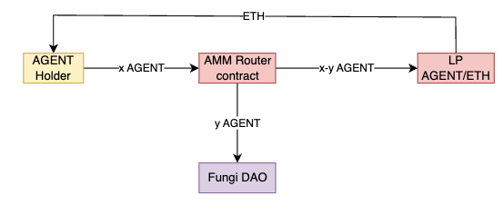

# AGENT Token

Fungi will deploy a taxable ERC-20 token, AGENT, as a standalone product to attract attention to the project and provide a financial stream for the subsidizing gas through the paymaster and promote further development of the ecosystem.

AGENT will be an ERC-20 token with the following characteristics hardcoded into the contract:

- **Max supply:** 999,999,999
- **Decimals:** 18
- **Ownable:** A feature inherited from the OpenZeppelin library. A DAO will act as the owner and decision making medium.
- **Taxable:** 
- **Tax range:** Specific types of transactions will be charged a fee no greater than X% to avoid the worry of abuse of creating a too large tax that extracts the whole value from the operations. 
- **Tax only DeFi operations:** The fee will only be applied on specific contract addresses related to DeFi operations such the routers of the AMMs and the aggregators.
- **DAO as the treasury:** All the AGENT collected from taxes will go to the DAO's treasury to be used and distributed transparently to maintain the development of the Fungi Agent's projects.
- **Updating of the tax %:** The percentage cannot be updated to an amount greater than X% defined during the contract creation, and will be noticed in advance to the community through the according communication channels.
- **ERC20Permit:** An extension that adds gasless approval feature to ERC20 tokens.

Upon achieving product-market fit, AGENT could be integrated into the incentive system, serving as a unit of exchange for agentic services.
